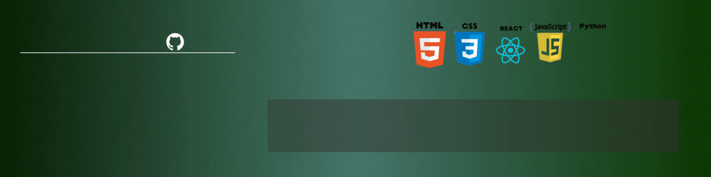
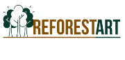

# ¡Hola! 👋 Soy un **Desarrollador Front-End**

Soy un desarrollador web **Front-end**, apasionado por crear interfaces **atractivas**, **interactivas** y optimizadas para la mejor **experiencia del usuario**. He colaborado en proyectos con diversas tecnologías tanto en el **front-end** como en el **back-end**, aunque mi enfoque está en el desarrollo Front-end.

## 🚀 Proyectos

- **Descripción:** Aplicación Web para la reforestación de bosques nativos. 
- **Rol:** Colaboración en un equipo de 3 en una simulación laboral en NoCountry.
- **Tecnologías:** HTML, CSS, Tailwind CSS, JavaScript, React.js, Java, Spring Security, JWT, Git, GitHub.
- **Fecha:** Septiembre 2024.

- **Descripción:** Aplicación Web para la compra y venta de astrofotografía.
- **Rol:** Proyecto final en 4Geeks Academy, con un equipo de 4 estudiantes.
- **Tecnologías:** HTML, CSS, Bootstrap, JavaScript, React.js, Python, Flask, JWT, SQLite, Git, GitHub.
- **Fecha:** Mayo 2024.

## 🎓 Educación

- **Desarrollador Full Stack**, 4Geeks Academy, Chile  
  Santiago, Chile

## 🌐 Idiomas
- **Español:** Nativo
- **Inglés:** A2 (Lectura), A1 (Escucha)

## 🛠️ Habilidades Técnicas

**Front-end:**

**Back-end:**

**Bases de datos:**

**Control de versiones:**

**Metodologías:**

<!--
**tonycq/tonycq** is a ✨ _special_ ✨ repository because its `README.md` (this file) appears on your GitHub profile.

Here are some ideas to get you started:

- 🔭 I’m currently working on ...
- 🌱 I’m currently learning ...
- 👯 I’m looking to collaborate on ...
- 🤔 I’m looking for help with ...
- 💬 Ask me about ...
- 📫 How to reach me: ...
- 😄 Pronouns: ...
- ⚡ Fun fact: ...
-->
